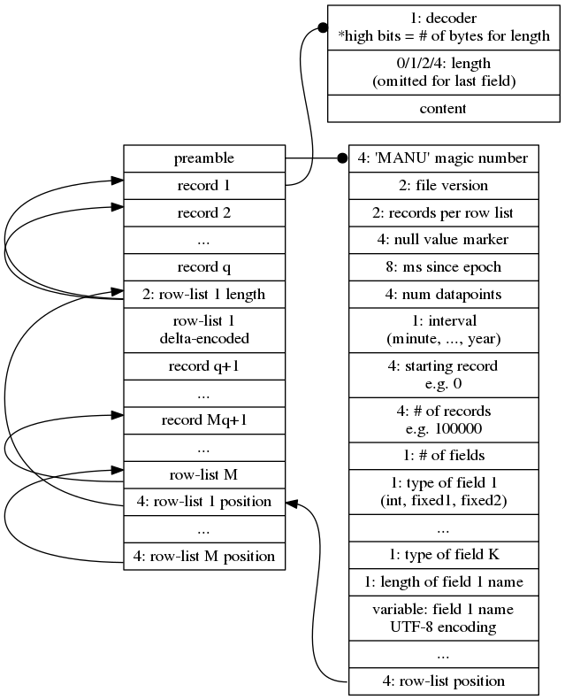

# File formats
## The index

The index maps from an identifier to a numeric index in `[1..# of IDs]`. It also tracks the # of identifiers so that a new identifier can be inserted and assigned a key promptly.

For simplicity, we use a SQLite DB to track this. Note that every table has an implicit `ROWID` column, starting at 1 and autoincrementing.

```sql
CREATE TABLE keys(key TEXT PRIMARY KEY);
```

This is a little less efficient--a random selection of 1M Wikipedia articles takes 58MB in SQLite, and 25MB as a sorted text file--but the index file is small relative to the data file, so the savings in dev time is worth it.

## The data files


Key IDs are contiguous. If a key is missing, it will have an entry in the pointer table, but it’ll be at the same offset as the next entry, and we’ll infer that it’s empty.

At 0.7 bytes/value: ~260MB for 1M items for a year at daily resolution.
At 1 byte/value, ~370MB.

### Encoders

When serializing, a different encoder can be selected for each field in each record.

Encoder 0 for integers and floats is the identity function - it just copies the input array.

# Operations
## Reads
- get-key key
  - Returns the ID for the key.
- describe-file file
  - Returns metadata about the file - start time, interval, # of datapoints, # of items, field descriptions.
- iterate-rows file
  -	Walks the file, returning an array of arrays of datapoints for each record.

## Writes
- ensure-keys key1, key2, …, keyN
  -	Given a set of keys, return their IDs, inserting them if needed.
- write-file start unit num-datapoints field-descriptors record-offset num-records iterator[array[array[_]]
  -	You can pass null arrays to indicate no data for a record.

## Future work
- merge file-1 file-2 … file-n
  -	Concatenate N files. Designed to let you partition data, eg you have 1 file with 10 years of data, and 1 file with this year’s data. When the year ticks over, you merge them.
